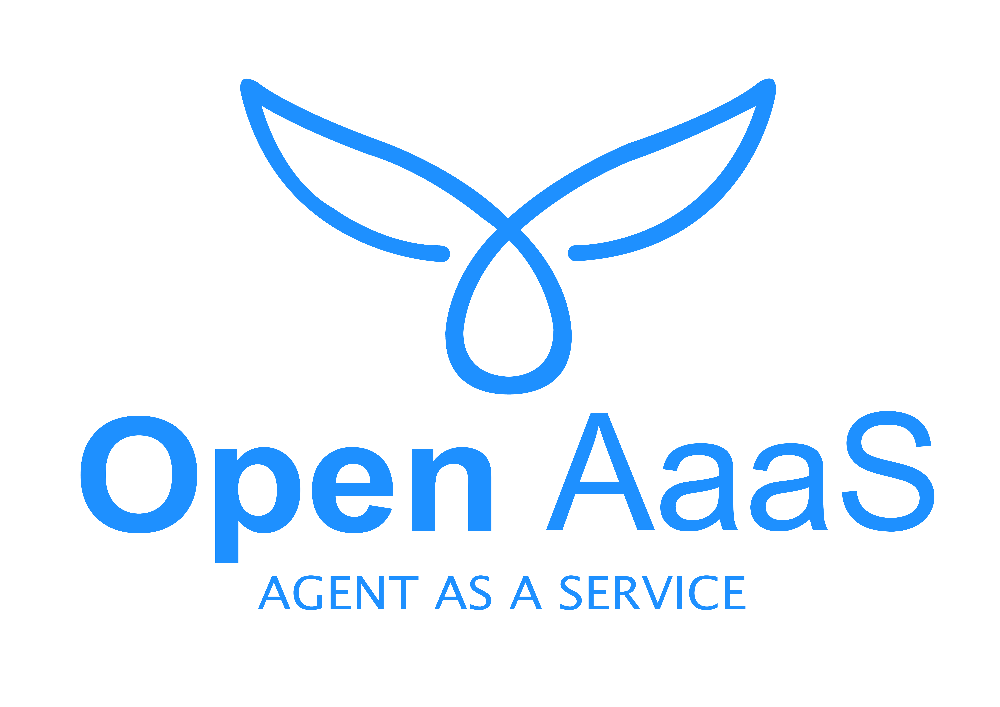
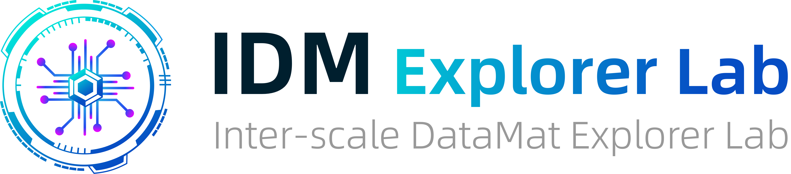

<p align="center">
  
</p>

<p align="center"><strong>OpenAaaS — Open Us to the Agentic World</strong></p>

<p align="center">
  <em>Agent as a Service. 将你的科研资源转化为可远程调用的智能体服务，接入统一的 Agent 调度网络。</em>
</p>

<p align="center">
  <a href="https://www.open-aaas.com">🌐 官网</a> ·
  <a href="./server/README.md">📖 server 文档</a> ·
  <a href="./agent-core/README.md">📖 agent-core 文档</a> ·
  <a href="#quick-start">🚀 快速开始</a>
</p>

<p align="center">
  
  
  
</p>

---

## What is OpenAaaS

科研工作流中，资源与能力往往被锁在各自的孤岛里：

- **🔒 数据锁在机房** — 千亿级实验数据、专用数据库，本地 AI 无法触达
- **📑 文献分散各处** — 文献库、知识图谱、预印本，检索和精读耗时耗力
- **🧠 专家能力孤立** — 每位科研人员的领域模型、分析工具，各自为政无法协作

**OpenAaaS 将这些孤岛连成网络。**

任何独立运行的 Agent——数据分析、文献精读、专家研讨，或你自研的专用工具——只需一个 `registration_token` 即可接入网络，被任意客户端一键调用。

你在熟悉的客户端里写一句提示词，网络自动分发给对应的远程智能体，结果直接返回。中间没有黑箱，每个智能体独立运行、自主管理。

## How it works

```
你的 Agent (pi / kimi / 自研 Agent)
    │
    │ HTTP API
    ▼
OpenAaaS Server (Rust + SQLite)
    │
    │ 短轮询
    ▼
Remote Agent (Docker 容器隔离执行)
```

**三层各司其职：**

| 层 | 组件 | 职责 |
|----|------|------|
| **客户端 Agent** | pi mono / Kimi Cli / Codex / Open Code / 自研Agent | 理解任务、调用远程服务、整合结果 |
| **OpenAaaS 网络** | Server (Rust + SQLite) | 任务调度、队列管理、认证授权、文件中转 |
| **远程 Agent** | agent-core + Docker | 向 Server 注册、短轮询获取任务、隔离执行、上报结果 |

---

## Features

- **🔧 零配置启动** — Server 首次运行自动生成 `config.toml`、SQLite 数据库、密钥，开箱即用
- **🐳 Docker 安全隔离** — 每个任务在独立容器中运行，通过 workspace 挂载实现输入输出，安全可控
- **💾 嵌入式优先** — SQLite 数据库 + 本地文件存储，无需 Redis/MySQL，单二进制即可部署
- **🔌 自描述 API** — `GET /api/v1/discovery` 无需认证，返回完整 API 文档、使用流程和示例
- **⚖️  自管负载** — Agent 自行控制并发，Server 不做复杂调度，极简可靠
- **🧩 渐进式披露** — 默认返回轻量摘要，按需获取详细用法，避免信息过载

---

## Try it Online

我们提供公共试用服务器 **`api.open-aaas.com`**，无需本地部署即可体验。

在支持 OpenAaaS 的客户端 Agent 中直接指定服务器地址，自动完成注册后即可提交任务：

> "帮我设置 OpenAaaS 的服务器地址为 api.open-aaas.com，然后提交一个任务"

---

## Quick Start

### 1. 启动 Server

```bash
cd server
cargo build --release
./target/release/open-aaas-server run
```

### 2. 创建 Service 并启动 Agent

```bash
cd agent-core
cargo build --release
./target/release/agent-core init
./target/release/agent-core register --token <registration_token> --name my-agent
./target/release/agent-core run
```

`registration_token` 需要先在 Server 上创建 Service 获取。Admin 可使用 Server 日志中的 API Key 调用 `POST /api/v1/services/` 创建。

Agent 执行器镜像需要提前构建：
```bash
cd executor-example && docker build -t open-aaas-executor:latest .
```
详见 [agent-core/README.md](./agent-core/README.md)

### 3. 通过客户端 Agent 提交任务

你的客户端也是一个 Agent。通过插件系统，在对话中直接提交任务：

> "帮我设置 OpenAaaS 的服务器地址为 api.open-aaas.com，然后提交一个数据分析任务"

客户端 Agent 会自动调用 OpenAaaS 工具完成注册、提交和结果获取。

## Project Structure

```
OpenAaaS/
├── server/           # HTTP 服务端 (Rust) — 任务调度、队列、鉴权、文件中转
├── agent-core/       # Agent 调度器 (Rust) — 注册、轮询、Docker 隔离执行
├── dash/             # 调试与管理员工具 (Python/Streamlit)
└── client-extension/ # 客户端扩展 — pi 插件、kimi 插件
```

---

## License

MIT License © IDM Explorer Lab


